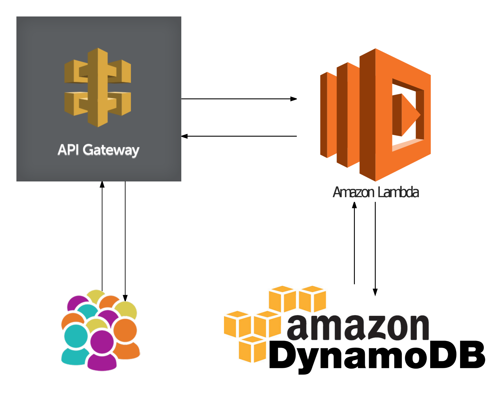
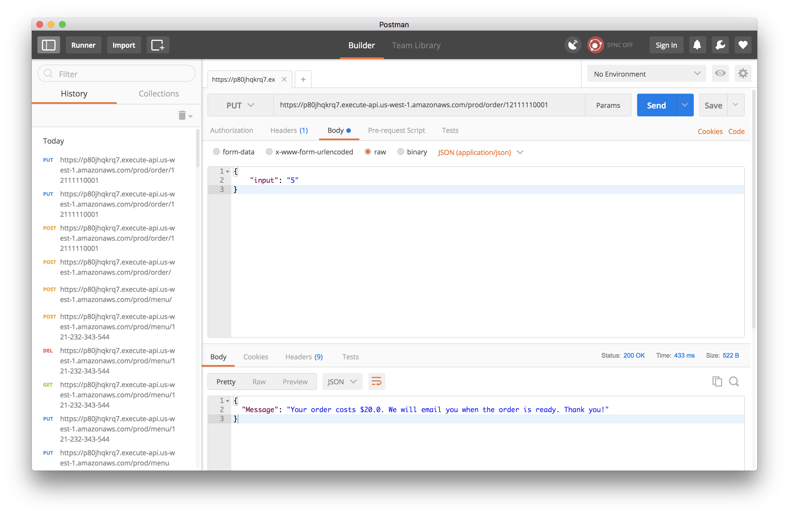

# Pizza-Menu-Ordering-System

## Architecture

## Rest Endpoint Screenshots
###Menu POST https://p80jhqkrq7.execute-api.us-west-1.amazonaws.com/prod/menu
Request:
  {
    "menu_id": "121-232-343-544",
    "store_name": "Pizzeria",
    "selection": [
        "Cheese",
        "Pepperoni",
        "Paneer"
    ],
    "size": [
        "Slide", "Small", "Medium", "Large", "X-Large"
    ],
    "price": [
        "3.50", "7.00", "10.00", "15.00", "20.00"
    ],
    "store_hours": {
        "Mon": "10am-10pm",
        "Tue": "10am-10pm",
        "Wed": "10am-10pm",
        "Thu": "10am-10pm",
        "Fri": "10am-10pm",
        "Sat": "11am-12pm",
        "Sun": "11am-12pm"
    }
}

Response:
  200 OK

