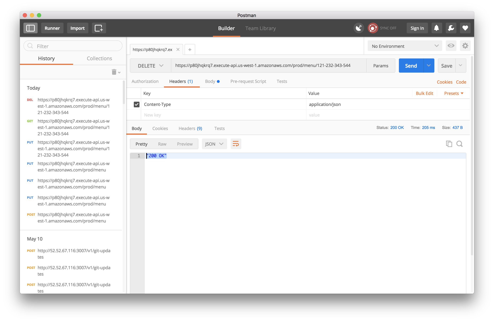

# Pizza-Menu-Ordering-System

## Architecture

## Rest Endpoint Screenshots
### Menu POST https://p80jhqkrq7.execute-api.us-west-1.amazonaws.com/prod/menu

### Menu PUT https://p80jhqkrq7.execute-api.us-west-1.amazonaws.com/prod/menu/121-232-343-544

### Menu GET https://p80jhqkrq7.execute-api.us-west-1.amazonaws.com/prod/menu/121-232-343-544

### Menu DELETE https://p80jhqkrq7.execute-api.us-west-1.amazonaws.com/prod/menu/121-232-343-544

### Order POST https://p80jhqkrq7.execute-api.us-west-1.amazonaws.com/prod/order/
#### Posting a new order

### ORDER PUT https://p80jhqkrq7.execute-api.us-west-1.amazonaws.com/prod/order/12111110001
#### 1st put is for chosing one of the offered selection

### ORDER PUT https://p80jhqkrq7.execute-api.us-west-1.amazonaws.com/prod/order/12111110001
#### 2nd put is for chosing one of the offered size

### ORDER GET https://p80jhqkrq7.execute-api.us-west-1.amazonaws.com/prod/order/12111110001
#### This is to see your order summary, status etc

